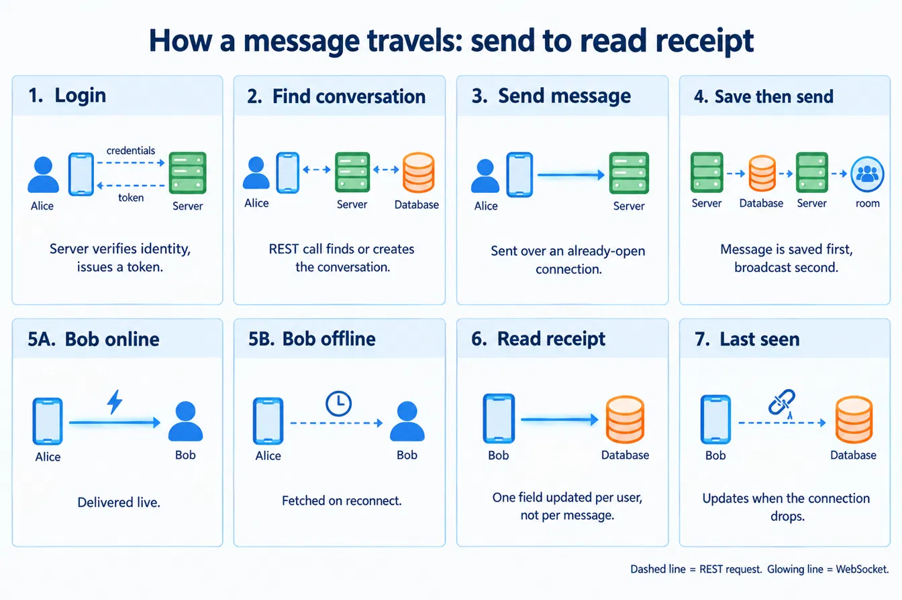

# Wisper

A real-time 1:1 text messaging app, built as a full-stack project to practice system design.

## Features

- 1:1 direct messaging (text only)
- Real-time delivery via WebSockets
- Read receipts (sent / seen)
- Last seen (shows when a user was last online)

## Tech Stack

- **Frontend:** React
- **Backend:** Node.js + Express
- **Real-time:** Socket.io
- **Database:** MySQL
- **Auth:** JWT

## System Design



## How It Works

1. User logs in and gets a JWT.
2. Opening a chat finds or creates a conversation between the two users (REST).
3. Sending a message goes over an open WebSocket connection.
4. The server saves the message to MySQL first, then broadcasts it to the conversation.
5. If the other user is online, they get it instantly. If offline, they get it from message history on reconnect.
6. Opening a conversation updates `last_read_at` for that user — this is how "seen" is tracked.
7. `last_seen_at` updates when a user disconnects.

## Data Model

- `users` — account info, last seen
- `conversations` — one row per chat
- `conversation_participants` — who's in each conversation, last read time
- `messages` — message content, sender, timestamp

## Setup

```bash
git clone <repo-url>
cd wisper

# Backend
cd backend
npm install
npm run dev

# Frontend
cd frontend
npm install
npm start
```

Set up a `.env` in `backend/` with your MySQL connection details and a JWT secret.

## Status

MVP in progress — 1:1 chat only. Group chat, media, and typing indicators are planned but not built yet.